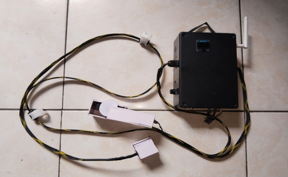
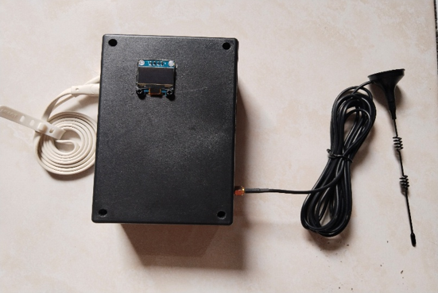
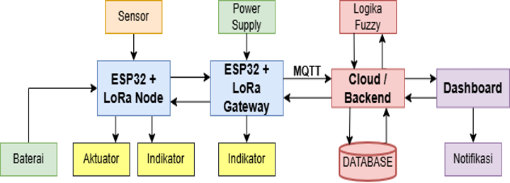

# InfuCare: Sistem Monitoring dan Kontrol Infus Cerdas Berbasis IoT untuk Layanan Home Care

**InfuCare** adalah ekosistem pemantauan dan kontrol infus medis cerdas berbasis Internet of Things (IoT) yang dirancang untuk mendukung operasional layanan kesehatan rawat jalan (*Home Care*) di wilayah pedesaan. 

Sistem ini memadukan transmisi telemetri nirkabel jarak jauh (**LoRa Ra-02**), arsitektur backend andal (**Golang Clean Architecture**), kontrol penghentian aliran otomatis via **Motor Servo MG996R**, dan estimasi sisa waktu cairan berbasis **Logika Fuzzy Tsukamoto**.

---

## 📌 Latar Belakang & Masalah Riil (Problem Statement)

Pada layanan rawat jalan (*home care*) di fasilitas kesehatan tingkat desa (studi kasus: **POSKESDES Lumban Jaean**):
1. **Keterbatasan Monitoring Jarak Jauh:** Bidan desa memiliki mobilitas tinggi dan menangani pasien rawat jalan dengan jarak tempuh hingga 1 km. Saat bertugas di luar desa, pemantauan kondisi infus bergantung sepenuhnya pada deskripsi verbal keluarga via telepon.
2. **Kelelahan Penjaga & Risiko Emboli Udara:** Pengawasan manual rentan mengalami kelalaian, terutama pada malam hari saat keluarga pasien mengalami kelelahan. Keterlambatan penanganan saat cairan habis berisiko menimbulkan komplikasi fatal seperti emboli udara (*insiden 1:47 hingga 1:3000 kasus*) atau peradangan vena/phlebitis (*mencapai 50,11% kasus*).
3. **Ketiadaan Deteksi Refluks Darah:** Fenomena darah mengalir balik ke selang infus (*blood backflow*) akibat penurunan tekanan hidrostatik sulit diidentifikasi secara dini oleh keluarga awam, memicu risiko penyumbatan jalur intravena dan kegagalan terapi.
4. **Keterbatasan Infrastruktur Internet:** Penelitian sebelumnya mengandalkan koneksi Wi-Fi berjarak pendek (16–24 meter) yang tidak realistis untuk perumahan pedesaan dan hanya memberikan respons pasif (notifikasi tanpa tindakan fisik darurat).

---

## 🩺 Prototipe Perangkat Keras (Hardware Prototype)

| Unit Pasien (Smart Infusion Node) | Unit Poskesdes (Central Gateway) |
| :---: | :---: |
|  |  |
| *Modul portabel: load cell, sensor optik, modul suara, baterai 18650, dan aktuator servo* | *Gateway penerima LoRa 433 MHz dengan antena eksternal, buzzer alarm, dan display OLED* |

---

## 🏗️ Arsitektur Sistem Terintegrasi

Sistem ini menghubungkan perangkat di kamar pasien dengan pos jaga medis bidan desa melalui empat lapisan arsitektur:

### Alur Komunikasi Data:
1. **Sensing Layer:** ESP32 membaca sisa berat cairan (Load Cell HX711), laju tetesan cairan (sensor optik TCRT5000), dan indikasi darah balik berdasarkan pergeseran frekuensi spektrum hijau (sensor warna TCS3200).
2. **Transmission Layer:** Data telemetri dikirim dalam format CSV terkompresi via radio LoRa 433 MHz menuju Central Gateway, lalu diteruskan ke broker MQTT melalui jaringan TCP/IP (WiFi).
3. **Backend Processing:** Backend Golang memproses data telemetri, komputasi estimasi sisa waktu via Logika Fuzzy Tsukamoto, pencatatan audit medis berbasis transaksi ACID di PostgreSQL, dan integrasi notifikasi darurat WhatsApp Gateway.
4. **Presentation Layer:** Dashboard web Next.js menampilkan visualisasi metrik secara real-time serta menyediakan kendali aktuator jarak jauh (*remote actuation*).

---

## 📦 Komponen Repositori (Monorepo Structure)

Repositori ini dikelola dengan pendekatan monorepo yang memisahkan boundary teknis tiap modul:

* [📂 hardware-esp32/](./hardware-esp32)  
  Firmware C++ untuk **Node Infus** dan **Central Gateway**, diagram skema pengkabelan (*wiring*), tabel pinout mikrokontroler, serta spesifikasi transmisi paket LoRa.
* [📂 infucare-backend/](./infucare-backend)  
  REST API dan *MQTT Subscriber* berbasis **Golang (Gin)** dengan implementasi *Clean Architecture*, transaksi basis data, dan integrasi WhatsApp Gateway.
* [📂 infucare-frontend/](./infucare-frontend)  
  Aplikasi web dashboard berbasis **Next.js (App Router)**, **TypeScript**, dan **Tailwind CSS** untuk stasiun pemantauan visual tenaga medis.

---

## 💡 Fitur Kunci & Keandalan Rekayasa

* **Autonomous Safety Failsafe:** Motor servo secara otomatis mengunci aliran selang infus saat ambang batas volume cairan menyentuh titik kritis atau saat sensor warna mengidentifikasi adanya aliran darah balik.
* **Topologi Catu Daya Ganda (Anti-Brownout):** Penerapan jalur regulator daya terpisah pada node pasien guna mencegah fenomena *brownout* mikrokontroler akibat lonjakan arus sesaat (*inrush current*) dari motor servo.
* **Non-Blocking Drop Counting:** Algoritma *debouncing* berbasis *Hardware Interrupt* pada sensor TCRT5000 memastikan setiap tetesan tercatat secara akurat tanpa terganggu oleh proses transmisi data radio.
* **Dual-Level Alert Mechanism:** Peringatan audio bertingkat di ruang pasien dan posko bidan, dipadukan dengan notifikasi darurat instan via WhatsApp Gateway.

---

## 📊 Hasil Pengujian & Validasi Dampak Solusi (Key Results & Impact)

Pengujian sistem dilakukan secara empiris pada purwarupa skala laboratorium teruji (**TKT 3**) untuk memvalidasi performa rekayasa terhadap permasalahan di lapangan:

### 1. Eliminasi Ketergantungan Internet Pasien via Radio LoRa
* **Hasil Uji:** Modul LoRa Ra-02 (433 MHz) berhasil mentransmisikan paket instruksi kendali dan data telemetri menembus rintangan fisik pemukiman padat (lorong dan gang) hingga jarak **101 meter** dengan tingkat keberhasilan **100% (0% packet loss)** pada latensi rata-rata **230–263 ms**.
* **Dampak:** Pasien di wilayah pedesaan tidak memerlukan kuota internet maupun jaringan Wi-Fi rumah; data tetap terkirim secara stabil dan instan ke stasiun pemantauan.

### 2. Transformasi Proteksi Pasif Menjadi Failsafe Otonom
* **Hasil Uji:** Mekanisme aktuator motor servo (MG996R) sukses mengeksekusi penutupan klem selang secara otomatis dan total seketika saat volume cairan menyentuh batas kritis (< 15%) atau saat darah balik terdeteksi. 
* **Stabilitas Perangkat:** Penerapan topologi catu daya ganda (*dual power supply*) terbukti **100% sukses mencegah fenomena brownout** mikrokontroler akibat lonjakan arus sesaat (*inrush current*) motor servo.
* **Dampak:** Mengeliminasi faktor kelalaian manusia (*human error*) dan kelelahan keluarga di malam hari, mencegah masuknya udara ke pembuluh darah pasien secara mandiri tanpa menunggu kedatangan bidan.

### 3. Deteksi Dini Refluks Darah Objektif
* **Hasil Uji:** Sensor warna TCS3200 terbukti presisi membedakan cairan infus bening (Ringer Laktat/NaCl) dan darah berdasarkan pergeseran frekuensi spektrum hijau, langsung memicu interupsi darurat ke aktuator dalam hitungan detik.
* **Dampak:** Menggantikan tebakan visual keluarga pasien dengan deteksi berbasis data spektral sebelum darah menggumpal atau menyumbat jarum infus.

### 4. Estimasi Waktu Adaptif Berbasis Fuzzy Logic
* **Hasil Uji:** Integrasi sensor Load Cell HX711 (penyimpangan/error hanya **1,47%**) dan Drop Counter TCRT5000 (akurasi **100%** berkat optimasi *hardware interrupt & debouncing*) diproses oleh mesin inferensi **Logika Fuzzy Tsukamoto** secara deterministik.
* **Dampak:** Mengubah deskripsi verbal keluarga yang tidak akurat menjadi prediksi estimasi sisa waktu (jam & menit) yang presisi pada Web Dashboard dan WhatsApp, memungkinkan bidan merencanakan waktu penggantian botol secara efisien.

---

## 🚀 Panduan Ringkas Instalasi Sistem

Untuk panduan konfigurasi mendalam pada tiap komponen, silakan merujuk ke dokumentasi masing-masing direktori:

1. **Hardware & Firmware:** Buka [Panduan Hardware](./hardware-esp32/README.md) untuk setup library, kalibrasi sensor, dan flashing sketch via Arduino IDE.
2. **Backend Services:** Buka [Panduan Backend](./infucare-backend/README.md) untuk konfigurasi basis data PostgreSQL dan variabel lingkungan `.env`.
3. **Web Dashboard:** Buka [Panduan Frontend](./infucare-frontend/README.md) untuk setup environment dan menjalankan development server Next.js.