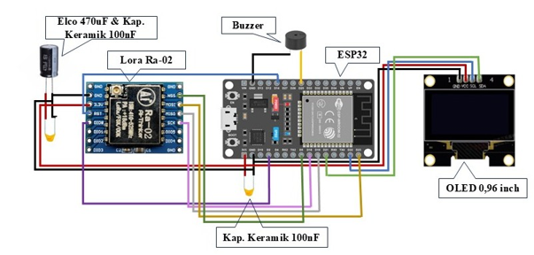
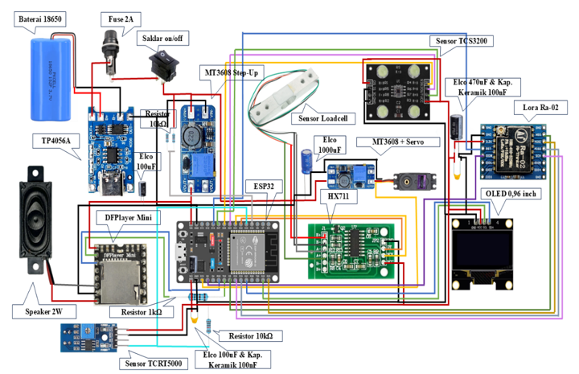

# InfuCare Firmware & Hardware (ESP32)

Sebelum melakukan flashing firmware ke ESP32, buka file sketch di Arduino IDE dan sesuaikan parameter berikut:

#### 1. Gateway (`firmware_gateway.ino`)
Buka bagian **Konfigurasi Jaringan** dan sesuaikan dengan jaringan serta broker yang sama dengan backend seperti contoh berikut:

| Variabel | Deskripsi | Contoh Nilai |
| :--- | :--- | :--- |
| `ssid` | Nama Hotspot / WiFi (2,4 GHz) | `"WiFi-Klinik"` |
| `password` | Kata Sandi WiFi | `"PasswordWiFi123"` |
| `mqtt_server` | IP Broker (IP LAN Laptop jika testing lokal, atau Cloud) | `"192.168.1.50"` atau `"broker.emqx.io"` |
| `mqtt_port` | Port MQTT Broker (Default: 1883) | `1883` |
| `mqtt_user` | Username autentikasi broker (harus cocok dengan backend) | `"Admin_InfuCare"` |
| `mqtt_password` | Password autentikasi broker (harus cocok dengan backend) | `"Rahasia123"` |

#### 2. Node Infus (`firmware_node.ino`)
Setiap perangkat infus memiliki identitas unik dan faktor kalibrasi:

| Variabel | Deskripsi |
| :--- | :--- |
| `deviceSN` | Serial Number unik alat (misal: `"ESP32-INF-001"`, `"ESP32-INF-002"`) |
| `calibration_factor` | Nilai kalibrasi sensor Load Cell HX711 |
| `batasSensorDarah` | Ambang frekuensi sensor warna TCS3200 untuk deteksi darah (Default: `515` Hz) |

## 🔌 Skema Rangkaian & Pemetaan Pin (Hardware Pinout)

### A. Gateway (ESP32)



| Komponen / Modul | Pin ESP32 | Mode / Protokol | Keterangan |
| :--- | :--- | :--- | :--- |
| **LoRa Ra-02 (SX1278)** | SCK: `GPIO 18`<br>MISO: `GPIO 19`<br>MOSI: `GPIO 23`<br>NSS: `GPIO 5`<br>RST: `GPIO 14`<br>DIO0: `GPIO 2` | SPI Bus | Transceiver nirkabel 433 MHz |
| **OLED Display 0.96"** | SDA: `GPIO 21`<br>SCL: `GPIO 22` | I2C (Addr: `0x3C`) | Monitor status jaringan, IP, dan jumlah node aktif |
| **Active Buzzer** | `GPIO 25` | Output (PWM Tone) | Alarm lokal dua tingkat (Warning & Emergency) |

---

### B. Node Infus Pintar (ESP32)



| Komponen / Modul | Pin ESP32 | Mode / Protokol | Keterangan |
| :--- | :--- | :--- | :--- |
| **Load Cell + HX711** | DOUT: `GPIO 32`<br>SCK: `GPIO 33` | Digital Serial | Pembacaan berat cairan infus secara kontinu |
| **Sensor Warna TCS3200** | S2: `GPIO 25`<br>S3: `GPIO 26`<br>OUT: `GPIO 27` | Frequency Output | Deteksi arus balik darah pada selang infus |
| **Tetesan (TCRT5000)** | `GPIO 35` | Hardware Interrupt (`FALLING`) | Pencacah tetesan cairan infus (Drop Counter) |
| **Motor Servo (MG996R)** | `GPIO 15` | PWM (50 Hz) | Aktuator mekanik pengunci/penjepit selang |
| **DFPlayer Mini (Audio)** | RX: `GPIO 17`<br>TX: `GPIO 16` | HardwareSerial2 (`9600 baud`) | Peringatan suara / audio instruksi medis |
| **Sensor Tegangan Baterai** | `GPIO 34` | ADC Input (Analog) | Pemantauan daya sel baterai 18650 |
| **LoRa Ra-02 (SX1278)** | SCK: `GPIO 18`<br>MISO: `GPIO 19`<br>MOSI: `GPIO 23`<br>NSS: `GPIO 5`<br>RST: `GPIO 14`<br>DIO0: `GPIO 2` | SPI Bus | Uplink telemetri & downlink kontrol dari Gateway |
| **OLED Display 0.96"** | SDA: `GPIO 21`<br>SCL: `GPIO 22` | I2C (Addr: `0x3C`) | Tampilan metrik lokal (Baterai, Vol, TPM, Status) |

---

## 📡 Protokol Data Telemetri

### 1. Format Uplink LoRa (Node ➡️ Gateway)
Data dikirim dalam format CSV terkompresi untuk meminimalkan *airtime* frekuensi:
```text
[device_sn],[weight_gram],[current_tpm],[blood_freq],[battery_pct],[temp],[session_active]
Contoh: ESP32-INF-001,485.5,20,520,88,36.5,1
```
### 2. Uplink Darurat & Peringatan (Node ➡️ Gateway)

Dikirim seketika (*event-driven*) saat kondisi abnormal terdeteksi di ruang pasien:
* **Deteksi Darah Balik:** `[device_sn],EMERGENCY_BLOOD,1`
* **Cairan Kritis:** `[device_sn],WARNING_EMPTY,1`

### 3. Downlink Kendali Jarak Jauh (Gateway ➡️ Node)

Instruksi dari dashboard web yang diteruskan oleh gateway melalui jaringan LoRa:

| Perintah String | Fungsi |
| :--- | :--- |
| `SERVO_LOCK` | Menggerakkan servo ke 95° untuk menutup/mengunci selang |
| `SERVO_UNLOCK` | Mengembalikan servo ke 0° untuk membuka kembali aliran selang |
| `TARE_RESET` | Mereset tara timbangan saat botol infus baru dipasang |
| `END_SESSION` | Mengakhiri sesi perawatan dan melepas kuncian aktuator |
| `SET_TARGET_TPM:<n>` | Mengatur target tetesan per menit untuk auto-koreksi sudut servo |
| `CFG:<alarm>:<kunci>` | Menyimpan konfigurasi batas ambang alarm dan batas kunci servo ke memori EEPROM/Preferences |
| `SET_VOL:<0-30>` | Menyesuaikan tingkat volume audio peringatan DFPlayer Mini |
| `SET_BLOOD_TH:<hz>` | Kalibrasi nilai ambang frekuensi sensor warna darah |