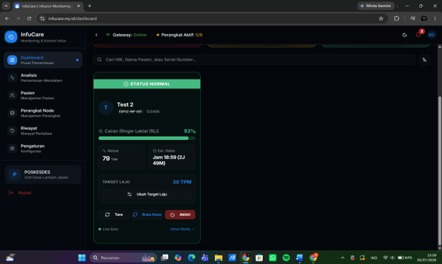
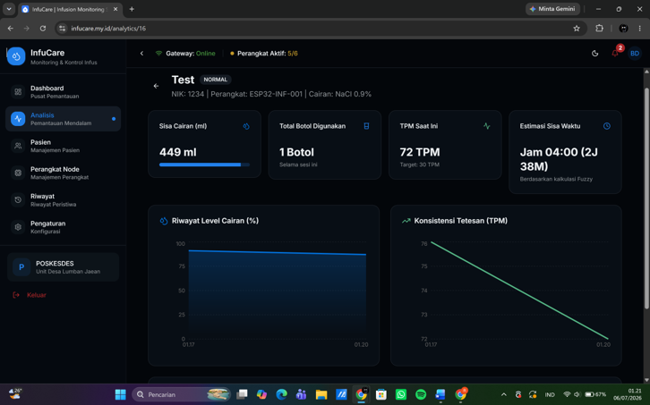
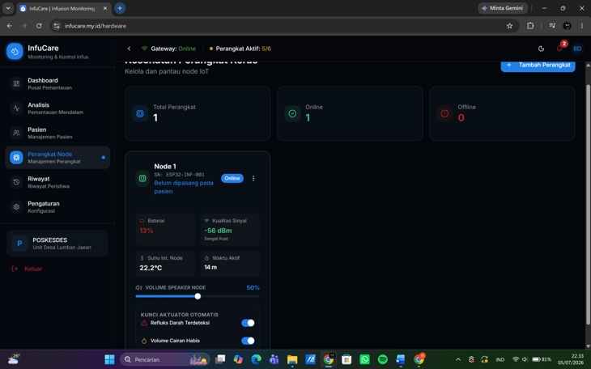
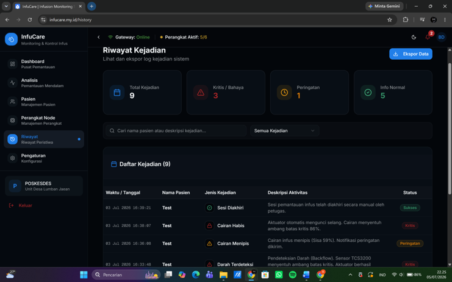

# InfuCare Web Dashboard (Frontend)


Antarmuka web modern untuk pemantauan telemetri cairan infus pasien, analitik riwayat medis, dan kendali perangkat aktuator ESP32 dari jarak jauh. Dibangun menggunakan arsitektur **Next.js App Router**, **TypeScript**, dan **Tailwind CSS**.

---

## 🖥️ Tampilan Antarmuka Web (UI Preview)

| Dashboard Pemantauan Real-time | Analitik Telemetri & Logika Fuzzy |
| :---: | :---: |
|  |  |
| *Status sesi infus aktif, sisa cairan, dan kendali klem selang* | *Grafik tren tetesan TPM dan estimasi habis berbasis Fuzzy Logic* |

| Telemetri & Manajemen Node IoT | Log Riwayat Kejadian Kritis |
| :---: | :---: |
|  |  |
| *Kesehatan perangkat: sinyal LoRa (RSSI), baterai, suhu, & aktuator* | *Audit trail peristiwa darurat (Deteksi Darah Balik & Cairan Habis)* |

---

## ✨ Fitur Utama

* **Real-time Telemetry Display:** Pemantauan langsung status volume cairan, laju tetesan (TPM), daya baterai, dan kestabilan sinyal LoRa pada tiap tiang infus.
* **Remote Hardware Actuation:** Pengiriman instruksi kendali motor servo (buka/kunci selang darurat) dan penyesuaian target TPM langsung dari antarmuka web.
* **Smart Emergency Indicator:** Tampilan peringatan visual seketika saat sensor mendeteksi arus balik darah atau cairan mendekati batas kritis.
* **Interactive Historical Charts:** Visualisasi tren data telemetri berbasis grafik untuk evaluasi berkala oleh tenaga medis.
* **Responsive Layout:** Antarmuka adaptif yang optimal diakses melalui layar desktop stasiun perawat maupun tablet petugas.

---

## 🛠️ Teknologi yang Digunakan

* **Framework:** Next.js (App Router)
* **Language:** TypeScript
* **Styling:** Tailwind CSS & Lucide Icons
* **State & Data Fetching:** React Hooks / Axios
* **Data Visualization:** Chart.js / Recharts

---

## ⚙️ Konfigurasi Environment

Sebelum menjalankan aplikasi, buat berkas `.env.local` di direktori `infucare-frontend/` dan sesuaikan URL backend API:

```env
# URL API Backend Go (Lokal atau Server)
NEXT_PUBLIC_API_BASE_URL="http://localhost:8080/api/v1"
```

## 🚀 Panduan Menjalankan Aplikasi

1. **Masuk ke Direktori Frontend:**
```bash
   cd infucare-frontend
```

2. **Pasang Dependensi:**
```bash
    npm install
    # atau jika menggunakan pnpm:
    pnpm install
```

3. **Jalankan Development Server:**
```bash
    npm run dev
```    
Kalau berhasil akan muncul http://localhost:3000 kemudian copy dan paste di web browser anda.
